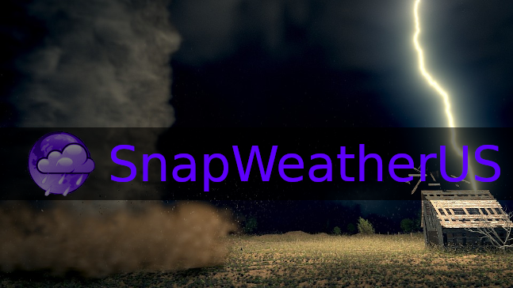
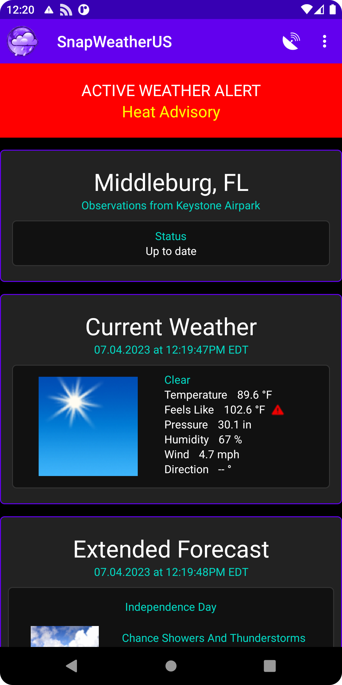
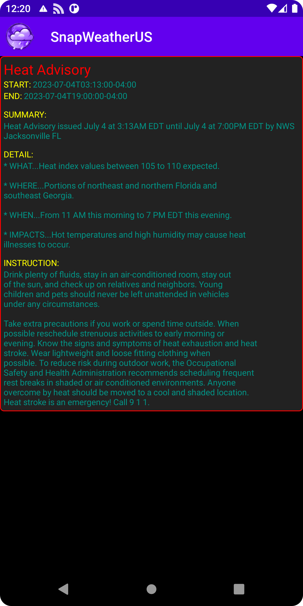
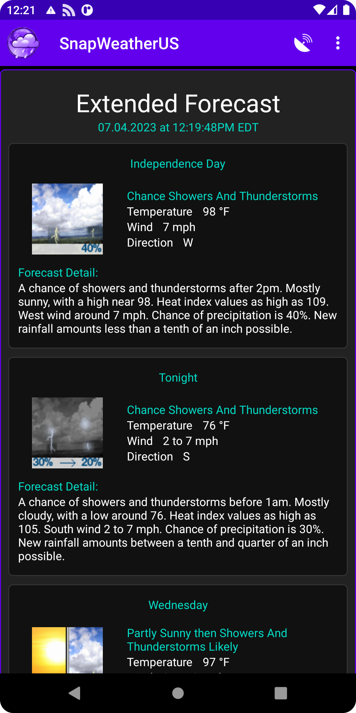
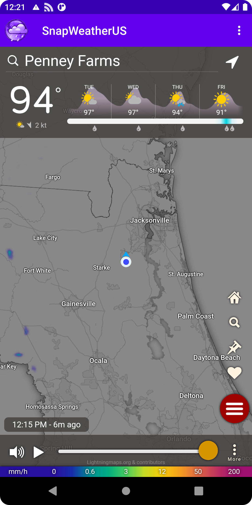

# SnapWeatherUS

## Android Application for:
Weather Forcasts, Alerts, and Radar for the United States

## Description:

Weather can happen in a Snap.

Get weather information when you need it for free, without ads, and have complete privacy with peace of mind. The application only needs your location to get you alerts and weather for where you currently are.

Created by: William Ruckman

Get current weather, extended weather, radar, and timely alerts with detailed descriptions..

## Features:

Here is a list of featues for SnapWeatherUS!

    United States only (Including Alaska, Hawaii, and territories)
    Current weather from nearest station to your location
    One week day and night extended forecast
    Customizable weather alerts with the ability to set desired levels (Extreme, Severe, Moderate, Minor, Unknown)
    Get alerts even if the application isn't open
    Detailed information on weather alerts
    Heat and Cold Warnings
        - Blue - Feels like temperature below 0°F
        - Yellow - Feels like temperature from 90-94°F
        - Orange - Feels like temperature from 95-99°F
        - Red - Feels like temperature above 100°F
    Current and animated radar
    Customizable radar layers
    Real wind direction indicator
    Weather data is time stamped of last update and the Status indicates if any errors occur downloading from API
    Background battery and data usage is optimized for best performance using google recommended standards (Android Developers - Optimize for battery life)
    API and data from weather.gov and windy.com

## Language:

English US only

## Screenshots:

## Website:

https://ruckman.net/snapweatherus.html
